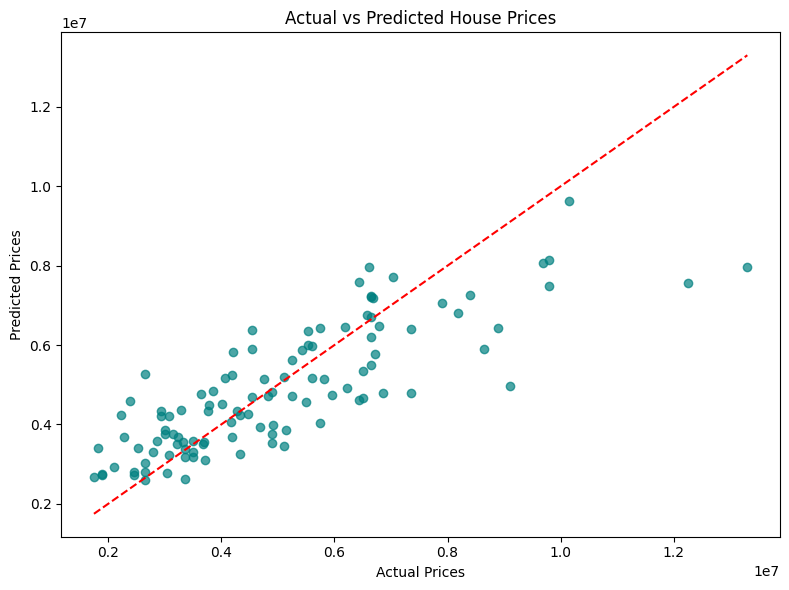

# Housing Price Prediction using Linear Regression

This project demonstrates an end-to-end workflow for predicting house prices using linear regression. It covers data preprocessing, model training, evaluation, visualization, and feature interpretation on a real housing dataset.
[Download the Housing Price Dataset](https://www.kaggle.com/datasets/harishkumardatalab/housing-price-prediction)

---

## Dataset

- **File:** `Housing.csv`
- **Rows:** 545
- **Columns:** 13 (mix of numeric and categorical features)
- **Target:** `price` (house sale price in INR)

---

## Steps Performed

### 1. Data Loading and Inspection
**Load the dataset and view the first few rows:**
```
import pandas as pd

df = pd.read_csv('Housing.csv')
print(df.head())
```
*This lets you verify the data structure and spot obvious issues.*

**Check data types and missing values:**
```
print(df.info())
```
*Confirms all columns are present and there are no missing values.*

---

### 2. Data Preprocessing

#### a. Identify Categorical Columns
```
categorical_cols = df.select_dtypes(include=['object']).columns.tolist()
cat_unique_counts = {col: df[col].nunique() for col in categorical_cols}
print(cat_unique_counts)
```
*Finds which columns need encoding.*

#### b. Encode Binary Categorical Columns
Map yes/no to 1/0
```
binary_map = {'yes': 1, 'no': 0}
for col in ['mainroad', 'guestroom', 'basement', 'hotwaterheating', 'airconditioning', 'prefarea']:
df[col] = df[col].map(binary_map)
```
*Converts all binary categorical columns to numeric.*

#### c. One-Hot Encode 'furnishingstatus'
```
furnishing_dummies = pd.get_dummies(df['furnishingstatus'], prefix='furnishingstatus')
df = pd.concat([df, furnishing_dummies], axis=1)
df.drop('furnishingstatus', axis=1, inplace=True)
```
*Creates separate columns for each furnishing status category.*

#### d. Convert Boolean Columns to Integers
```
bool_cols = ['furnishingstatus_furnished', 'furnishingstatus_semi-furnished', 'furnishingstatus_unfurnished']
for col in bool_cols:
df[col] = df[col].astype(int)
```
*Ensures all features are numeric.*

#### e. Final Data Check
```
print(df.head())
print(df.info())
```
*Verifies all columns are now numeric and ready for modeling.*

[Updated Housing Dataset](Housing-Updated.csv)

---

### 3. Train-Test Split
```
**Split the data into training and testing sets:**
from sklearn.model_selection import train_test_split

X = df.drop('price', axis=1)
y = df['price']

X_train, X_test, y_train, y_test = train_test_split(X, y, test_size=0.2, random_state=42)

print("X_train shape:", X_train.shape)
print("X_test shape:", X_test.shape)
```
*Reserves 20% of the data for unbiased model evaluation.*

---

### 4. Model Training

**Train a linear regression model:**
```
from sklearn.linear_model import LinearRegression

model = LinearRegression()
model.fit(X_train, y_train)

print("Coefficients:", model.coef_)
print("Intercept:", model.intercept_)
```
*Fits the model and outputs learned feature weights.*

---

### 5. Model Evaluation

**Evaluate with standard regression metrics:**
```
from sklearn.metrics import mean_absolute_error, mean_squared_error, r2_score

y_pred = model.predict(X_test)

mae = mean_absolute_error(y_test, y_pred)
mse = mean_squared_error(y_test, y_pred)
r2 = r2_score(y_test, y_pred)

print(f"Mean Absolute Error (MAE): {mae:.2f}")
print(f"Mean Squared Error (MSE): {mse:.2f}")
print(f"R² Score: {r2:.4f}")
```
*Shows how close predictions are to actual prices and the proportion of variance explained.*

---

### 6. Visualization

**Plot Actual vs Predicted Prices:**
```
import matplotlib.pyplot as plt

plt.figure(figsize=(8,6))
plt.scatter(y_test, y_pred, alpha=0.7, color='teal')
plt.xlabel("Actual Prices")
plt.ylabel("Predicted Prices")
plt.title("Actual vs Predicted House Prices")
plt.plot([y_test.min(), y_test.max()], [y_test.min(), y_test.max()], 'r--')
plt.tight_layout()
plt.show()
```
*Visual check for model fit—points near the red dashed line are well-predicted.*

---

### 7. Feature Interpretation

**Display feature importances (coefficients):**
```
feature_names = X_train.columns.tolist()
coefficients = model.coef_
feature_coefficients = dict(zip(feature_names, coefficients))
sorted_features = sorted(feature_coefficients.items(), key=lambda x: abs(x), reverse=True)

for feature, coef in sorted_features:
print(f"{feature}: {coef:.2f}")
```
*Higher absolute coefficients mean greater influence on price.*

**Example Output Table:**

| Feature                        | Coefficient     | Interpretation                                                                 |
|---------------------------------|----------------|-------------------------------------------------------------------------------|
| bathrooms                      | 1,094,444.79   | Each additional bathroom increases price by ~₹1,094,445                       |
| airconditioning                |   791,426.74   | Having air conditioning increases price by ~₹791,427                          |
| hotwaterheating                |   684,649.89   | Having hot water heating increases price by ~₹684,650                         |
| prefarea                       |   629,890.57   | Being in a preferred area increases price by ~₹629,891                        |
| stories                        |   407,476.59   | Each additional story increases price by ~₹407,477                            |
| basement                       |   390,251.18   | Having a basement increases price by ~₹390,251                                |
| mainroad                       |   367,919.95   | Being on a main road increases price by ~₹367,920                             |
| furnishingstatus_unfurnished   |  -233,469.44   | Unfurnished homes sell for ~₹233,469 less than the baseline                   |
| guestroom                      |   231,610.04   | Having a guestroom increases price by ~₹231,610                               |
| parking                        |   224,841.91   | Each additional parking spot increases price by ~₹224,842                     |
| furnishingstatus_furnished     |   180,175.63   | Furnished homes sell for ~₹180,176 more than the baseline                     |
| bedrooms                       |    76,778.70   | Each additional bedroom increases price by ~₹76,779                            |
| furnishingstatus_semi-furnished|    53,293.81   | Semi-furnished homes sell for ~₹53,294 more than the baseline                 |
| area                           |       235.97   | Each additional square foot increases price by ~₹236                          |

---

## Key Insights

- **Bathrooms, air conditioning, and hot water heating** have the strongest positive impact on house price.
- **Unfurnished status** reduces price, while furnished/semi-furnished increases it.
- **Model explains about 65% of price variance** (R² = 0.65).
- Some prediction error remains, which is typical for real-world data.

---

## Example Visualization



---

## Conclusion

This project demonstrates a complete linear regression workflow for house price prediction—including data cleaning, encoding, modeling, evaluation, and interpretation.

---

**Author:** Saksham Bindal
